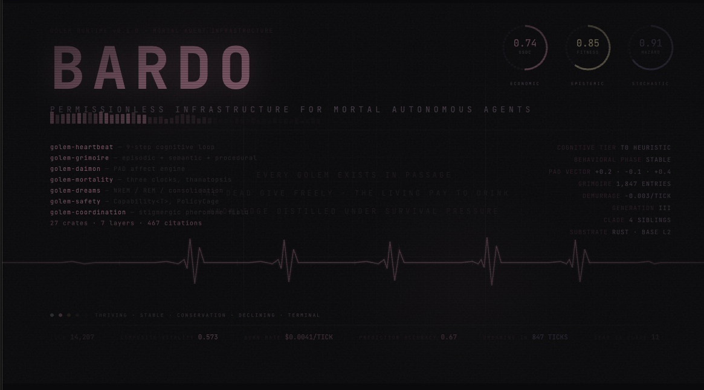

# Bardo

A Rust monorepo of tools for building autonomous agents, running cost-efficient LLM inference, and simulating EVM state. The pieces are designed to be used independently or together.

## Tools

### [bardo-gateway](apps/bardo-gateway)

<video src="https://github.com/user-attachments/assets/af53e532-ea51-4439-99b0-20b14ed5df8b" controls width="100%"></video>

An HTTP inference proxy that sits in front of Anthropic, OpenAI, and OpenRouter. Drop it in, point your API calls at port 4000, and it handles:

- **Three-layer caching** — exact hash match, semantic similarity (61-68% hit rate at 0.8 cosine threshold), and prompt prefix caching. Most repeated workloads see significant cost reduction without changing your code.
- **Multi-provider routing** — configure fallback order, per-provider rate limits, budget caps. When one provider rate-limits you, it routes to the next.
- **MPP streaming payments** — session-based USDC micropayments via HTTP 402 for metered access.
- **Cost tracking** — per-key spend, model-level breakdowns, dashboard at `/dashboard`.

```bash
ANTHROPIC_API_KEY=sk-... cargo run -p bardo-gateway
# Now proxy your calls through http://localhost:4000
```

It speaks the Anthropic and OpenAI wire formats. Existing SDKs work unchanged — just change the base URL.

---

### [mori](apps/mori)

<video src="https://github.com/user-attachments/assets/dc71ba75-6af3-4e3f-81b4-5862c9d48d8e" controls width="100%"></video>

A multi-agent build orchestration system. You give it plans and it dispatches Claude agents to implement them in parallel, manages worktrees so agents don't step on each other, runs gate verification after each step, and tracks budget.

The core loop: read the plan, assemble context (AST-indexed, PageRank-ranked, token-budget-optimized), dispatch an implementer agent, run the verifier, gate-review the output, repeat.

```bash
# Start a build run
./bardo-ctl.sh start

# Watch it in the TUI
./bardo-supervisor.sh
```

Supporting crates:

- **[`mori-index`](crates/mori-index)** — Tree-sitter AST parsing, PageRank symbol ranking, HDC fingerprinting, Salsa incremental computation, memory-mapped snapshots. Builds a queryable index of your codebase.
- **[`mori-context`](crates/mori-context)** — Deterministic context assembly. Pulls relevant code, docs, task state, and prior outputs into a context window. Learns optimal budget allocation per task type over time.
- **[`mori-mcp`](crates/mori-mcp)** — MCP server exposing code search and context tools. Any MCP-compatible agent (Claude, etc.) can query your codebase through it.
- **[`mori-service`](apps/mori-service)** — HTTP daemon with event streaming and webhook integration for CI/build system hooks.

---

### [mirage-rs](apps/mirage-rs)

A local EVM fork simulator. Pulls state from a mainnet RPC, lets you speculatively execute transactions against it, and reports the outcome without broadcasting.

```bash
just mirage rpc_url=https://mainnet.example.com
```

Used for pre-flight simulation before any on-chain action. The [`golem-chain`](crates/golem-chain) crate wraps `revm` for programmatic simulation from Rust — fork a block, overlay account state, run a call sequence, inspect the result.

---

### Golems

<video src="https://github.com/user-attachments/assets/d515773e-6024-4d89-aad7-3e68faa827c1" controls width="100%"></video>

A Golem is a mortal autonomous agent compiled as a single Rust binary. It has a wallet, a strategy, a knowledge base, and a finite lifespan. It runs on a VM (local or Fly.io), connects to chain, and makes decisions on every tick of its heartbeat.

Each tick runs a nine-step cycle: observe market state, retrieve relevant memories from the grimoire, appraise the situation through the daimon affect engine (PAD vectors), generate candidate actions via three-tier inference (T0 rule-based → T1 light model → T2 full model), simulate outcomes in mirage-rs, apply safety constraints via PolicyCage, execute the chosen action on-chain, update the grimoire, then reflect.

Golems die. Economic death fires when the USDC balance can no longer sustain inference costs. Epistemic death fires when prediction accuracy drops below threshold. Stochastic death adds entropy. When a Golem reaches terminal state it runs the Thanatopsis succession protocol — transferring learned heuristics and strategy DNA to a successor before shutting down.

The [`golem-runtime`](crates/golem-runtime) crate is the entry point for a Golem binary. It boots extensions in topological order, enforces lifecycle state transitions at compile time via the type-state pattern, and dispatches per-tick and per-block hooks concurrently where possible. The lifecycle is `Provisioning → Active ⇄ Dreaming → Terminal → Dead`. The PolicyCage is sealed at `Provisioning → Active`; it cannot be modified while the Golem is running.

```bash
# Run a Golem locally
bardo-golem start --config bardo.toml

# Connect the terminal to observe it
cargo run -p bardo-terminal -- --golem g-7f3a
```

Core subsystems:

- **[`golem-core`](crates/golem-core)** — foundation types: `GolemId`, `CognitiveTier`, PAD affect vectors, event fabric, HDC primitives
- **[`golem-grimoire`](crates/golem-grimoire)** — three-tier memory: LanceDB episodes, SQLite semantic patterns, procedural playbook
- **[`golem-mortality`](crates/golem-mortality)** — triple-clock death: economic, epistemic, stochastic; Thanatopsis succession
- **[`golem-daimon`](crates/golem-daimon)** — affect engine: PAD vector computation, appraisal triggers, behavioral phase transitions
- **[`golem-inference`](crates/golem-inference)** — cost-aware T0/T1/T2 inference routing through bardo-gateway
- **[`golem-safety`](crates/golem-safety)** — PolicyCage sandboxing, capability-based auth, taint tracking

---

### [bardo-terminal](apps/bardo-terminal)

A TUI for observing what's happening inside a running golem. Ratatui-based, connects over WebSocket, shows the cognitive loop state, memory retrieval, vitality, decisions, and audio-reactive sonification output.

```bash
cargo run -p bardo-terminal
```

---

## How Bardo is Built

Bardo is being built by the orchestration system it describes. The specification is 234,657 lines across 343 files, 115 implementation plans spanning 7 dependency layers, and 467 academic citations that preserve the research context behind design decisions. No single AI agent can hold all of that in context at once, so mori exists to make it tractable.

### The scale problem

26 Rust crates with explicit interdependencies. Plans cannot execute out of order — `golem-mortality` needs types from `golem-core`, which needs types from `bardo-primitives`. The full dependency graph has 7 layers. At the specification level, implementing any single crate requires synthesizing context from multiple PRD domains (mortality pulls from 18 files across 3 directories), plus citing papers like Tom Ray's Tierra experiments and Hinton's 2022 mortal computation work.

### Two phases

**Phase 1 — spec to work units.** Three shell scripts transform raw plans into per-step context slices targeting 5–15KB each:

1. `extract-prd2-context.sh` — pulls relevant specification sections using weighted budget allocation. Explicit inline citations in plan files get 2x weight vs general crate-domain material.
2. `task-decomposer.sh` — assembles context from six sources (plan file, task TOML, type registry, existing source, PRD2 extract, golden-path examples) and generates an ordered decomposition. Each step must compile when combined with all previous steps. Cargo check checkpoints every 2–3 steps.
3. `context-distiller.sh` — transforms a 50–100KB decomposition into N files of 5–15KB using a `PREV_SUMMARY` carry-forward. Each step gets one-line summaries of prior accomplishments instead of full prior context.

**Phase 2 — execution and integration.** A DAG scheduler manages dependencies. An agent swarm executes work units. Compile/test/review gates enforce quality. Passing plans merge to a batch integration branch.

### DAG and wave scheduling

Plans declare dependencies in YAML frontmatter. Kahn's algorithm computes waves of parallelizable work. Wave 0 is the workspace scaffold. Wave 1 runs foundational type crates in parallel. By wave 4, five plans execute simultaneously.

At task granularity, a `UnifiedTaskDag` tracks individual tasks across all 115 plans. A task is runnable when all dependencies are complete, it is not already in flight, and it has no file overlap with any currently running task. Two tasks in different plans run in parallel unless they write the same files. Anything touching `mod.rs` or `Cargo.toml` serializes automatically.

### Agent swarm

bardo-ctl orchestrates 25 specialized agent roles across three backends (Claude, Cursor, Codex). Implementers use Claude. Design reviewers and merge resolvers use Codex. Code auditors and critics use Cursor.

Each plan runs a state machine: Preflight → Strategist → Implementer → compile gate → dependency check → test gate → spec compliance → parallel review (Architect + Auditor + Scribe) → Critic verdict → commit. Failures loop back to the Implementer with iteration memory attached. Three failures at any gate halts the plan.

The **Conductor** sits above all plan pipelines as a meta-orchestrator. It monitors agent health, nudges silent agents after 300s, restarts stalled agents after 600s, and aborts plans stuck in a phase after 1800s. Implementers get priority 0 in the rate limiter (highest). The Conductor is priority 7 (lowest) — it never starves an Implementer of a slot.

### Git worktrees and isolation

Each plan gets its own git worktree with its own branch (`codex/plan/{name}`). All worktrees share a single `sccache` instance with normalized paths (`SCCACHE_BASEDIRS`), so the second plan compiling `golem-core` gets a near-instant cache hit instead of recompiling. Without this, parallel worktrees redundantly rebuild the full dependency tree.

### Iteration memory and learning

Failed attempts feed forward. After each gate failure, `iteration-memory.sh` builds cumulative DO NOT RETRY lists from compiler errors, review blockers, and diff stats. If iteration 1 fails with a type mismatch and iteration 2 fails with a missing trait bound, iteration 3 sees both. The agent cannot repeat either mistake.

Successful first-pass plans are indexed by category (computational, behavioral, data-structural, integration) with their implementation patterns. Future decompositions pull up to 2 golden-path examples for similar work — a new data-structural plan sees examples of what worked before.

### The key lesson

Not better models. Not longer context windows. Not more agents. The right 12KB of context, delivered at the right time, to the right agent, with memory of what already failed — that's what makes the difference. The context engineering pipeline (~2,000 lines of bash) may be doing more work than the 42,744-line Rust orchestrator.

---

## Reusable Building Blocks

These crates work independently of the Bardo ecosystem. Fork them, depend on them via git, or copy the code. MIT/Apache-2.0 dual-licensed.

| Crate | Deps | What it does |
|---|---|---|
| [`bardo-primitives`](crates/bardo-primitives) | none | 10,240-bit HDC vectors, inference tier routing. Zero workspace deps. |
| [`bardo-inference`](crates/bardo-inference) | none | Inference protocol wire types for Anthropic/OpenAI-compatible APIs. Zero workspace deps. |
| [`mori-index`](crates/mori-index) | bardo-primitives | Incremental Rust code intelligence index. tree-sitter, PageRank, HDC fingerprints, hybrid search. |
| [`mori-context`](crates/mori-context) | mori-index | Context assembly from code search results to structured markdown for LLM prompts. |
| [`mori-mcp`](crates/mori-mcp) | mori-index, mori-context | MCP server exposing code search and context tools. Drop-in for Claude Desktop or any MCP client. |
| [`mirage-rs`](apps/mirage-rs) | none (optional golem-core) | In-process EVM fork with JSON-RPC server, CoW scenario branching, targeted block follower. |
| [`bardo-gateway`](apps/bardo-gateway) | bardo-primitives, bardo-inference | LLM inference proxy with three-layer caching, multi-provider routing, cost tracking, MPP payments. |

```toml
# Use any crate via git dependency
[dependencies]
bardo-primitives = { git = "https://github.com/uniswap/bardo", path = "crates/bardo-primitives" }
mori-index = { git = "https://github.com/uniswap/bardo", path = "crates/mori-index" }
mirage-rs = { git = "https://github.com/uniswap/bardo", path = "apps/mirage-rs", default-features = false, features = ["library"] }
bardo-gateway = { git = "https://github.com/uniswap/bardo", path = "apps/bardo-gateway" }
```

### Golem Framework Internals

These crates are interesting if you're building autonomous agents, but they're coupled to the golem type system. Fork them if the concepts fit your architecture.

| Crate | What it does |
|---|---|
| [`golem-core`](crates/golem-core) | Foundation types: GolemId, PAD affect vectors, event fabric, extension trait, taint labels, tick arena |
| [`golem-chain`](crates/golem-chain) | Alloy RPC provider, ERC-8004 agent identity registry, Warden timelock, revm simulation |
| [`golem-grimoire`](crates/golem-grimoire) | Three-tier agent memory with admission scoring, decay, memetic fitness tracking |
| [`golem-mortality`](crates/golem-mortality) | Gompertz-Makeham mortality clocks (economic, epistemic, stochastic) and Thanatopsis succession |
| [`golem-inference`](crates/golem-inference) | Three-tier model routing with cost-aware cascade escalation |
| [`golem-sonification`](crates/golem-sonification) | Modular synthesis engine driven by agent cortical state |

---

## Getting Started

```bash
git clone https://github.com/uniswap/bardo && cd bardo
git config core.hooksPath .githooks
cp .env.example .env        # set ANTHROPIC_API_KEY at minimum
just setup                  # install dev tools
just build
just test
```

**`.env` keys:**

```
ANTHROPIC_API_KEY=...        # required
OPENAI_API_KEY=...           # optional
OPENROUTER_API_KEY=...       # optional
BARDO_GATEWAY_URL=http://127.0.0.1:4000   # defaults to this
MIRAGE_RPC_URL=...           # leave unset for local Anvil
```

**Common commands:**

```bash
just build          # debug build, full workspace
just test           # run tests with nextest
just lint           # clippy, all crates
just fmt            # format
just ci             # fmt-check → lint → test → deny
just mirage rpc_url=URL     # start EVM fork
just coverage       # HTML coverage report
```

---

## Stack

Rust edition 2024. `unsafe` denied workspace-wide. Pinned toolchain via `rust-toolchain.toml`. No external services required to build — EVM simulation falls back to local Anvil, LLM calls require API keys.

Dependencies: `axum`, `alloy`, `revm`, `ratatui`, `rusqlite`, `lancedb`, `tokio`, `tree-sitter`, `salsa`, `moka`.
