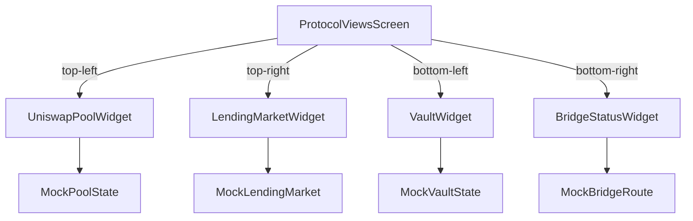
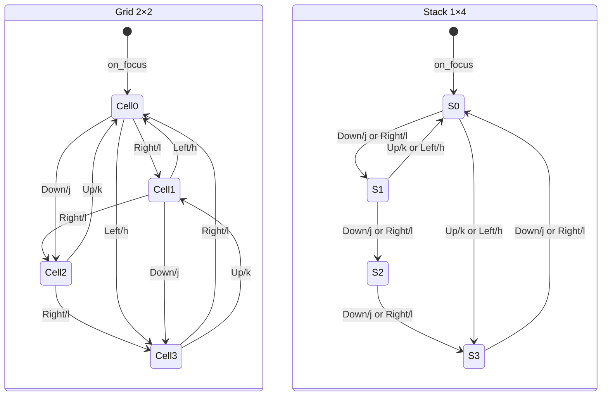

# bardo-terminal: Protocol Views

The Protocol Views screen gives the terminal its first DeFi content. It renders a 2×2 grid of four widgets — a Uniswap pool, a lending market, an ERC-4626 vault, and a bridge route — using placeholder data until the chain intelligence subsystems come online in Plans 70a–70c.

## Context and Motivation

Without this screen, the terminal could navigate and report system health, but had no visibility into on-chain activity. An operator supervising the agent needs to see at minimum: what's happening in the Uniswap pools the agent trades, how lending market utilization looks before borrowing, whether vault positions are earning, and where bridge transfers stand.

That's what this screen provides, from one panel per protocol family.

The screen sits in the terminal primitives track (Plans 04–08d), before the chain intelligence subsystems (Plans 17–19) and live data connections (Plans 70a–70c). Every data field is a mock placeholder with a `TODO(plan-70a)` annotation identifying what real subsystem will replace it.

## Module Structure

```
apps/bardo-terminal/src/
├── mock/
│   └── protocol_data.rs         ← MockPoolState, MockLendingMarket, MockVaultState, MockBridgeRoute
├── widgets/protocol/
│   ├── uniswap_pool.rs          ← UniswapPoolWidget
│   ├── lending_market.rs        ← LendingMarketWidget
│   ├── vault.rs                 ← VaultWidget
│   └── bridge_status.rs        ← BridgeStatusWidget
└── screens/
    └── protocol_views.rs        ← ProtocolViewsScreen
```

## Screen Layout



*Standard 2×2 grid layout. Collapses to 1×4 stack when `area.width < 60` or `LayoutBreakpoint::Compact`.*

## Navigation



- `Tab` → `AppAction::NextScreen`
- `BackTab` → `AppAction::PrevScreen`
- `q` → `AppAction::Quit`

## Mock Data Strategy

The `mock` module holds four placeholder structs with field shapes that match what the real chain intelligence types will produce. Using `mock_default()` rather than `Default` makes the placeholder status visible at every call site.

| Mock type | Replacement (Plans 70a–70c) |
|-----------|---------------------------|
| `MockPoolState` | `golem_chain_intelligence::protocol_state::UniswapPoolState` |
| `MockLendingMarket` | `golem_chain_intelligence::protocol_state::LendingMarketState` |
| `MockVaultState` | `golem_chain_intelligence::protocol_state::VaultState` |
| `MockBridgeRoute` | `golem_chain_intelligence::bridge::BridgeRouteState` |

Every field sourced from a live subsystem carries a `// TODO(plan-70a): connect to <subsystem>` comment.

## Widget Reference

### UniswapPoolWidget

Displays one Uniswap V3/V4 pool. Layout from top to bottom:

1. Bordered block with title `" ETH/USDC 0.05% Base "`
2. Current price in quote token (`BONE` color, bold)
3. Tick range bar — `◆` cursor at current position, `░` fill
4. Liquidity depth sparkline (braille, 2 rows, `ROSE` color)
5. Footer — TVL and 24h volume in compact USD

**Border color:** `BORDER_ACTIVE` when the current tick is inside the active range, `WARNING` when out-of-range.

**Tick range bar formula:**
```
cursor_pos = floor(position_fraction × bar_width)
position_fraction = (current_tick − lower_tick) / (upper_tick − lower_tick)
```
Clamped to `[0.0, 1.0]`. Returns `None` for zero-width ranges.

**Fee tier formatting:** `bps / 100.0` formatted to 2 decimal places. `5 → "0.05%"`, `30 → "0.30%"`, `100 → "1.00%"`.

**USD compact notation:**

| Value | Format |
|-------|--------|
| ≥ $1B | `$X.XB` |
| ≥ $1M | `$X.XM` |
| ≥ $1K | `$X.XK` |
| < $1K | `$X.XX` |

**Minimum heights:** `height < 3` → exits; `height < 5` → skips sparkline.

### LendingMarketWidget

Displays one lending market (Aave V3, Morpho, Compound). Layout:

1. Header: `" Aave V3 · USDC "` (abbreviated to just asset symbol when `width < 20`)
2. Utilization percentage label
3. Utilization gauge bar with color-coded thresholds
4. Supply APY (`SUCCESS`) and borrow APY (rose, or `WARNING` above 10%)
5. Total supplied and borrowed in compact USD (shown only when `area.height >= 5`)

**Utilization color thresholds:**

| Range | Color | Meaning |
|-------|-------|---------|
| util < 0.80 | `SUCCESS` — `Rgb(112, 136, 122)` | Healthy |
| 0.80 ≤ util < 0.95 | `WARNING` — `Rgb(170, 136, 85)` | Approaching capacity |
| util ≥ 0.95 | `DANGER` — `Rgb(204, 144, 168)` | Near full |

All APY fields are fractions. Display as `field * 100.0` with `"%.2f%%"` format.

### VaultWidget

Displays one ERC-4626 vault (Beefy, Yearn, or generic). A simple labeled table:

| Field | Color | Notes |
|-------|-------|-------|
| NAV/share | `BONE` | Precision varies by magnitude |
| TVL | `ROSE` | Compact USD |
| APY | `SUCCESS` | Fraction × 100 |
| 24h | `SUCCESS`/`DANGER`/`TEXT_DIM` | Signed percentage |

**NAV precision:**

| NAV value | Decimal places |
|-----------|----------------|
| > 1000 | 2 |
| ≥ 0.01 | 4 |
| < 0.01 | 6 |

**24h change:** positive values get a `+` prefix and `SUCCESS` color; negative keep their `-` and use `DANGER`; zero uses `TEXT_DIM`.

### BridgeStatusWidget

Displays a bridge route or active transfer. Full layout (height ≥ 4):

1. Border title: `" Across · Ethereum→Base "` (route omitted when `width < 18`)
2. Amount: `"5,000.00 USDC"` in `BONE`
3. Fee and ETA: `"Fee: $1.85  |  ETA: ~18s"` in `TEXT_DIM`
4. Status badge (with progress bar when `InFlight`)
5. Route arrow: `Ethereum ──→ Base`

Collapsed layout (height < 4): status badge and amount only, no border.

**Status badge colors:**

| Status | Glyph | Color |
|--------|-------|-------|
| `Quoted` | `◌` | `TEXT_DIM` |
| `Pending` | `◌` | `WARNING` |
| `InFlight` | `◈` | `ROSE` |
| `Complete` | `●` | `SUCCESS` |
| `Failed` | `✗` | `DANGER` |

**Progress bar formula (InFlight only):**
```
progress_pct = clamp((elapsed_secs / estimated_time_secs) × 100, 0, 100)
```
Returns 0 when `submitted_at_secs == 0` or `estimated_time_secs == 0`.

## ScreenId Extension

`ProtocolViews` is the 30th variant in `ScreenId`. Window name: `"PROTOCOLS"`. Tab name: `"Protocols"`. It's the only screen not in the original six window groups.

```rust
// screen.rs — the full catalog is now 30 entries
const SCREEN_CATALOG: [ScreenId; 30] = [
    // ... 29 prior screens ...
    ScreenId::ProtocolViews,
];
```

## Color Reference

From `palette.rs` (matches `prd2/18-interfaces/04-design-system.md §2`):

```
BONE          Rgb(200, 184, 144)  prices, large values
BORDER        Rgb(24, 20, 32)     unfocused borders
BORDER_ACTIVE Rgb(170, 112, 136)  focused border, in-range pool border
ROSE          Rgb(170, 112, 136)  sparkline, InFlight status
ROSE_DIM      Rgb(122, 80, 96)    cell label titles, route arrows
ROSE_DEEP     Rgb(58, 32, 48)     tick bar out-of-range fill
SUCCESS       Rgb(112, 136, 122)  in-range, healthy util, positive change
WARNING       Rgb(170, 136, 85)   out-of-range border, high util, pending
DANGER        Rgb(204, 144, 168)  critical util, negative change, failed
TEXT_PRIMARY  Rgb(152, 128, 144)  secondary values, chain names
TEXT_DIM      Rgb(88, 72, 88)     labels, dim decoration
BG_RAISED     Rgb(12, 10, 14)     gauge background
```

## Testing

```bash
cargo test -p bardo-terminal -- --nocapture

# Targeted
cargo test -p bardo-terminal -- mock::protocol_data --nocapture
cargo test -p bardo-terminal -- widgets::protocol --nocapture
cargo test -p bardo-terminal -- screens::protocol_views --nocapture
```

Key invariants the tests enforce:
- `position_fraction` returns `None` for zero-width ranges and clamps outside ranges to `{0.0, 1.0}`
- Borrow APY must exceed supply APY in mock data
- Utilization color threshold boundaries at exactly 0.80 and 0.95
- `flight_progress_pct` clamps to 100 on overrun and returns 0 when timing is missing
- Focus cycles 0→1→2→3→0 (Right), 0→2→0 (Down in grid), 0→1→2→3→0 (Down in stack)
- `on_focus` resets focused cell to 0
- Screen catalog contains exactly 30 entries with `ProtocolViews` last

Manual smoke test: run `cargo run -p bardo-terminal`, Tab to "PROTOCOLS", verify mock data in all four cells, confirm arrow key focus movement, resize below 60 columns to trigger stack layout, confirm Down moves by 1 in stack mode.
