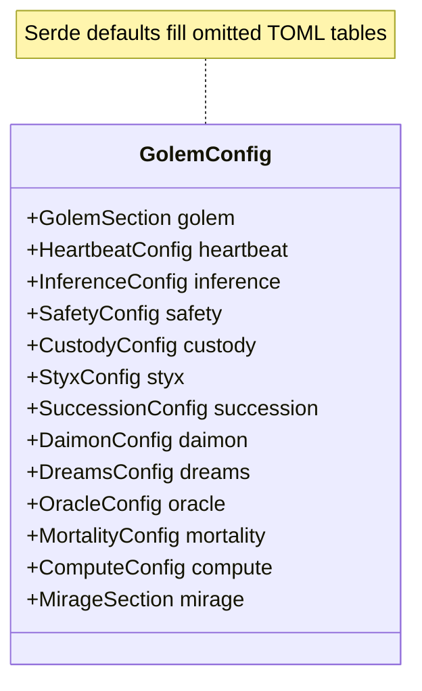
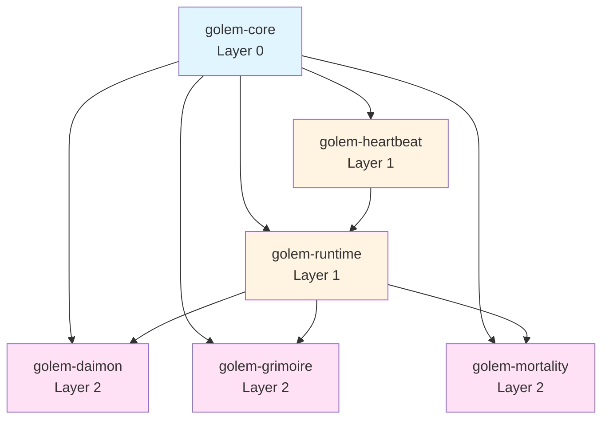
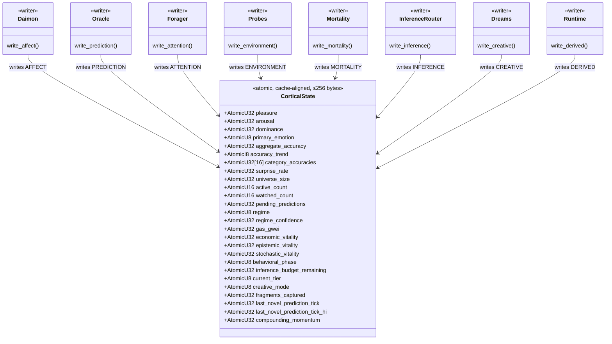
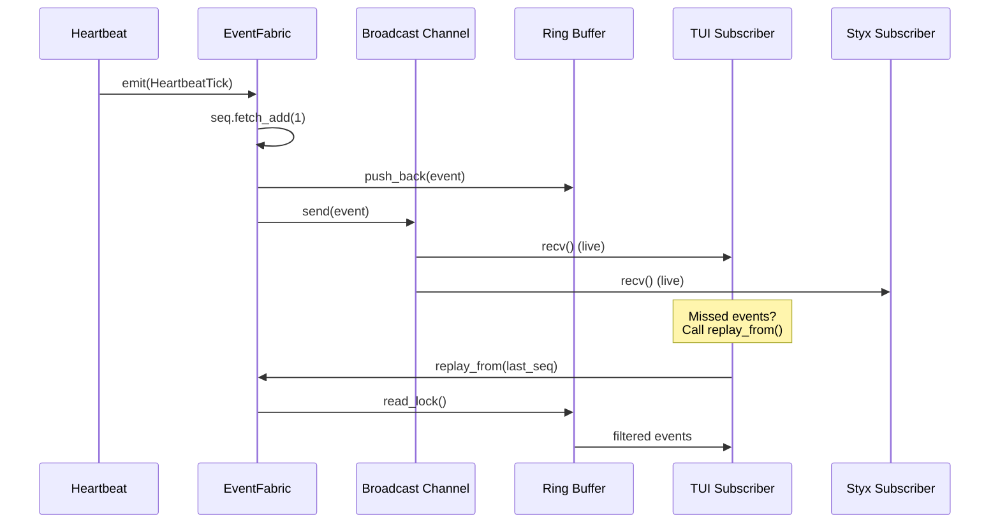
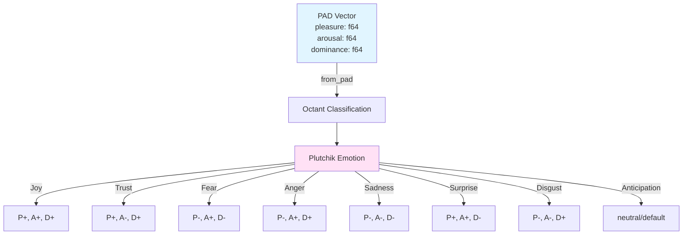

# golem-core

## What It Is

`golem-core` is the Layer 0 foundation crate for Bardo. It holds the shared vocabulary that later crates build on: runtime identity, `golem.toml` configuration, the lock-free cortical surface, the typed event fabric, the extension hook system, taint labels, hyperdimensional primitives, and the tick-scoped arena allocator.

The crate does not depend on any other workspace crate. It still uses ordinary Cargo dependencies (serde, tokio, uuid, and so on). That split keeps shared types stable without pulling higher-layer code into the foundation.

## Features

- `GolemId` for UUID-backed runtime identity
- `GolemConfig` for the canonical `golem.toml` schema, including the live `mirage` sidecar section
- `GolemError` and `Result` as the typed error surface
- `CorticalState`, `CorticalSnapshot`, `PadVector`, `BehavioralPhase`, and `PlutchikEmotion` for zero-latency shared perception
- `EventFabric`, `GolemEvent`, `EventPayload`, and `Subsystem` for non-blocking broadcast with bounded replay
- `Extension`, `ExtensionRegistry`, `HookId`, and hook context/action types for lifecycle orchestration
- `TaintLabel` and `TaintedString` for explicit information-flow tracking
- `CognitiveTier` for inference routing across `T0`, `T1`, and `T2`
- `HdcVector` for 10,240-bit hypervector operations
- `TickArena` for per-tick bump allocation

## Getting Started

Import the crate root and use the re-exports directly:

```rust
use std::{convert::TryFrom, path::Path};

use golem_core::{
    CognitiveTier, CorticalState, EventFabric, EventPayload, GolemConfig, GolemId, Subsystem,
    TaintLabel, TaintedString, TickArena,
};

fn example() -> golem_core::Result<()> {
    let golem_id = GolemId::new();
    let tier = CognitiveTier::try_from(1)?;
    let config = GolemConfig::from_file(Path::new("golem.toml"))?;

    let cortical = CorticalState::new();
    cortical.write_affect(0.5, -0.3, 0.1, 7);
    let snapshot = cortical.snapshot();

    let events = EventFabric::new(1_024);
    events.emit(
        Subsystem::Heartbeat,
        42,
        EventPayload::HeartbeatComplete {
            tick: 42,
            duration_ms: 12,
            actions_taken: 3,
        },
    );

    let arena = TickArena::new();
    let secret = TaintedString::new("0xabc".to_owned(), TaintLabel::WalletSecret);
    let copied = arena.alloc(secret.value.clone());

    let _ = (golem_id, tier, config, snapshot, copied);
    Ok(())
}
```

For extensions, register a `dyn Extension`, call `build()`, and then fire the hooks you need:

```rust
use std::sync::Arc;

use golem_core::{AfterTurnCtx, Extension, ExtensionRegistry};

async fn run_hook(registry: &ExtensionRegistry) -> anyhow::Result<()> {
    let mut ctx = AfterTurnCtx::default();
    registry.fire_after_turn(&mut ctx).await
}

fn wire_extension(registry: &mut ExtensionRegistry, ext: Arc<dyn Extension>) {
    registry.register(ext);
    registry.build();
}
```

## Configuration

`GolemConfig` is the canonical runtime schema loaded from `golem.toml`. Top-level fields are fixed: every section below is a field on `GolemConfig` (not optional omitted keys in Rust—defaults apply when TOML omits a table).



**Figure:** Top-level `GolemConfig` fields (all sections deserialize with defaults when omitted in TOML).

The implementation includes the sections used by the workspace today:

- `golem`
- `heartbeat`
- `inference`
- `safety`
- `custody`
- `styx`
- `succession`
- `daimon`
- `dreams`
- `oracle`
- `mortality`
- `compute`
- `mirage`

All top-level sections derive defaults, so an empty input string parses into a complete configuration. `GolemConfig::from_file`, `GolemConfig::from_str`, and `GolemConfig::with_env_overrides` share the same override behavior.

Environment overrides use `GOLEM_*` for per-golem runtime settings and `BARDO_*` for platform services. The crate currently resolves the following overrides:

- `GOLEM_NAME`
- `GOLEM_STRATEGY_CATEGORY`
- `GOLEM_NETWORK`
- `GOLEM_MODE`
- `GOLEM_FUNDING`
- `GOLEM_CUSTODY_MODE`
- `GOLEM_TRANSFER_RESTRICTION`
- `GOLEM_TICK_INTERVAL`
- `GOLEM_DELIBERATION_THRESHOLD`
- `GOLEM_MAX_DAILY_COST`
- `GOLEM_INFERENCE_PAYMENT`
- `GOLEM_INFERENCE_DAILY_BUDGET`
- `GOLEM_SPEND_LIMIT_TX`
- `GOLEM_SPEND_LIMIT_DAILY`
- `GOLEM_SUCCESSION_AUTO`
- `GOLEM_SUCCESSION_BUDGET`
- `GOLEM_ORACLE_ENABLED`
- `GOLEM_DAIMON_ENABLED`
- `GOLEM_APPRAISAL_MODEL`
- `GOLEM_DREAMS_ENABLED`
- `GOLEM_DREAM_SCHEDULE`
- `GOLEM_DREAM_INFERENCE_PROVIDER`
- `GOLEM_COMPUTE_TIER`
- `BARDO_STYX_ENABLED`
- `BARDO_STYX_HOST`
- `BARDO_CLADE_ENABLED`
- `BARDO_STYX_DAILY_BUDGET`
- `BARDO_STYX_MONTHLY_BUDGET`
- `BARDO_IMMORTAL`
- `BARDO_MORTALITY_ENABLED`
- `BARDO_STOCHASTIC_SEED`
- `BARDO_MIRAGE_URL`
- `BARDO_MIRAGE_HOST`
- `BARDO_MIRAGE_PORT`
- `BARDO_MIRAGE_TIMEOUT_MS`
- `BARDO_MIRAGE_RETRY_ATTEMPTS`
- `BARDO_MIRAGE_RETRY_BACKOFF_MS`

`GOLEM_MODE` also synchronizes `compute.mode` so the compute tier and top-level deployment mode stay aligned.

```rust
use golem_core::{ComputeTier, DeploymentMode, GolemConfig};

fn load_configs() -> golem_core::Result<()> {
    let from_file = GolemConfig::from_file(std::path::Path::new("golem.toml"))?;
    let from_str = GolemConfig::from_str(
        r#"
        [golem]
        name = "oracle-3"
        "#,
    )?;

    let _ = (from_file, from_str);
    Ok(())
}

fn env_example(config: GolemConfig) -> golem_core::Result<GolemConfig> {
    let config = config.with_env_overrides()?;
    let tier = match config.compute.tier {
        ComputeTier::Micro | ComputeTier::Small | ComputeTier::Medium | ComputeTier::Large => {
            config.compute.tier
        }
    };
    let _mode: DeploymentMode = config.compute.mode;
    let _ = tier;
    Ok(config)
}
```

Secrets are not stored in the config struct. API keys, wallet keys, and similar material are expected from the environment or a keystore, not from `golem.toml`.

## API

### Identity And Errors

```rust
pub struct GolemId(uuid::Uuid);
impl GolemId {
    pub fn new() -> Self;
    pub fn from_uuid(uuid: uuid::Uuid) -> Self;
    pub fn as_uuid(&self) -> &uuid::Uuid;
}
impl std::fmt::Display for GolemId;
impl From<uuid::Uuid> for GolemId;
impl From<GolemId> for uuid::Uuid;
```

The wrapped UUID is not a public field; use `new`, `from_uuid`, `as_uuid`, or `Into<uuid::Uuid>`.

```rust
pub enum GolemError {
    Config(String),
    Init(String),
    Extension { extension: String, source: anyhow::Error },
    EventFabric(String),
    CorticalState(String),
    Io(std::io::Error),
    TomlParse(toml::de::Error),
    Serde(serde_json::Error),
}
pub type Result<T> = std::result::Result<T, GolemError>;
```

### Configuration

```rust
pub struct GolemConfig {
    pub golem: GolemSection,
    pub heartbeat: HeartbeatConfig,
    pub inference: InferenceConfig,
    pub safety: SafetyConfig,
    pub custody: CustodyConfig,
    pub styx: StyxConfig,
    pub succession: SuccessionConfig,
    pub daimon: DaimonConfig,
    pub dreams: DreamsConfig,
    pub oracle: OracleConfig,
    pub mortality: MortalityConfig,
    pub compute: ComputeConfig,
    pub mirage: MirageSection,
}
impl GolemConfig {
    pub fn from_file(path: &std::path::Path) -> Result<Self, GolemError>;
    pub fn from_str(s: &str) -> Result<Self, GolemError>;
    pub fn with_env_overrides(self) -> Result<Self, GolemError>;
}
```

The config module also exports the nested enums and sections used by downstream crates, including `StrategyCategory`, `Network`, `DeploymentMode`, `CustodyMode`, `TransferRestriction`, `InferencePayment`, `ProviderType`, `AppraisalModel`, `DreamSchedule`, `ComputeTier`, and the nested `Styx*`, `Oracle*`, `Mortality*`, and `MirageSection` structs.

### Cortical State

```rust
#[repr(C, align(64))]
pub struct CorticalState { /* private atomic fields */ }
impl CorticalState {
    pub fn new() -> std::sync::Arc<Self>;
    pub fn pad(&self) -> PadVector;
    pub fn prediction_accuracy(&self) -> f32;
    pub fn phase(&self) -> BehavioralPhase;
    pub fn snapshot(&self) -> CorticalSnapshot;
    pub fn write_affect(&self, pleasure: f32, arousal: f32, dominance: f32, emotion: u8);
    pub fn write_prediction(
        &self,
        accuracy: f32,
        trend: i8,
        categories: &[f32; 16],
        surprise: f32,
        pending: u32,
    );
    pub fn write_attention(&self, universe: u32, active: u16, watched: u16, pending: u32);
    pub fn write_environment(&self, regime: u8, confidence: f32, gas_gwei: f32);
    pub fn write_mortality(&self, economic: f32, epistemic: f32, stochastic: f32, phase: u8);
    pub fn write_inference(&self, budget_remaining: f32, tier: u8);
    pub fn write_creative(&self, mode: u8, fragments: u32, last_novel_tick: u64);
    pub fn write_derived(&self, momentum: f32);
}
pub struct CorticalSnapshot {
    pub pleasure: f32,
    pub arousal: f32,
    pub dominance: f32,
    pub primary_emotion: u8,
    pub aggregate_accuracy: f32,
    pub accuracy_trend: i8,
    pub surprise_rate: f32,
    pub pending_predictions: u32,
    pub universe_size: u32,
    pub active_count: u16,
    pub watched_count: u16,
    pub regime: u8,
    pub regime_confidence: f32,
    pub gas_gwei: f32,
    pub economic_vitality: f32,
    pub epistemic_vitality: f32,
    pub stochastic_vitality: f32,
    pub behavioral_phase: u8,
    pub inference_budget_remaining: f32,
    pub current_tier: u8,
    pub creative_mode: u8,
    pub fragments_captured: u32,
    pub last_novel_prediction_tick: u64,
    pub compounding_momentum: f32,
}
pub struct PadVector { pub pleasure: f64, pub arousal: f64, pub dominance: f64 }
impl PadVector {
    pub const ZERO: Self;
    pub fn clamp(&self, min: f64, max: f64) -> Self;
}
pub enum BehavioralPhase { Thriving, Stable, Conservation, Declining, Terminal }
impl BehavioralPhase {
    pub fn from_u8(v: u8) -> Self;
}
pub enum PlutchikEmotion {
    Joy,
    Trust,
    Fear,
    Surprise,
    Sadness,
    Disgust,
    Anger,
    Anticipation,
}
impl PlutchikEmotion {
    pub fn from_pad(pad: &PadVector) -> Self;
}
```

`phase()` loads the `behavioral_phase` atomic and maps it with `BehavioralPhase::from_u8`. It does not derive a phase from vitality floats; the mortality path is expected to store the correct phase byte when it calls `write_mortality`.

`snapshot()` returns the fields on `CorticalSnapshot` above. It does not copy the 16-wide `category_accuracies` array from live state (that array exists only on `CorticalState`). Reads are still best-effort and non-transactional, so fields can reflect adjacent ticks if writers overlap.

### Event Fabric

```rust
pub struct EventFabric { /* live broadcast sender + replay buffer + sequence counter */ }
impl EventFabric {
    pub fn new(capacity: usize) -> Self;
    pub fn emit(&self, subsystem: Subsystem, tick: u64, payload: EventPayload);
    pub fn subscribe(&self) -> tokio::sync::broadcast::Receiver<GolemEvent>;
    pub fn replay_from(&self, after_seq: u64) -> Vec<GolemEvent>;
}
pub struct GolemEvent {
    pub seq: u64,
    pub ts_millis: u64,
    pub tick: u64,
    pub subsystem: Subsystem,
    pub payload: EventPayload,
}
pub enum Subsystem {
    Heartbeat,
    Perception,
    Daimon,
    Mortality,
    Grimoire,
    Dreams,
    Context,
    Inference,
    Tools,
    Risk,
    Coordination,
    Lifecycle,
    Engagement,
    Session,
    Creature,
    System,
}
pub enum EventPayload { /* 52 typed variants across 16 subsystems */ }
```

`emit` is non-blocking, `subscribe` attaches a live receiver, and `replay_from` returns buffered events with `seq >= after_seq`. The live broadcast channel capacity is caller-supplied, while the replay ring buffer is fixed at 10,000 events.

### EventPayload variants

`EventPayload` is a large enum (52 variants today, one per typed event). Grouping matches the `Subsystem` that typically emits them:

| Area | Variants |
|------|----------|
| Heartbeat | `HeartbeatTick`, `HeartbeatComplete` |
| Perception | `MarketObservation` |
| Daimon | `DaimonAppraisal`, `SomaticMarkerFired` |
| Mortality | `VitalityUpdate`, `PhaseTransition`, `DeathClockAlarm` |
| Grimoire | `InsightPromoted`, `HeuristicEvolved`, `KnowledgeDecayed`, `WarningActivated`, `ScarRecorded`, `CausalLinkUpdated`, `CuratorCycleComplete` |
| Dreams | `DreamStart`, `DreamPhaseTransition`, `DreamReplay`, `DreamCounterfactual`, `DreamConsolidation`, `DreamComplete`, `MicroConsolidation` |
| Context | `ContextAssembled`, `ContextPolicySelfTuned` |
| Inference | `InferenceStart`, `InferenceToken`, `InferenceComplete` |
| Tools | `ToolStart`, `ToolProgress`, `ToolComplete` |
| Risk | `PermitCreated`, `PermitStateChange`, `RiskAssessment` |
| Coordination | `CladeSyncComplete`, `BloomUpdated`, `PheromoneDeposited`, `PheromoneRead`, `BloodstainReceived`, `CausalEdgePublished` |
| Lifecycle | `LifecycleTransition`, `DeathInitiated`, `SuccessorSpawned`, `HealthStatus` |
| Engagement | `AchievementUnlocked`, `MilestoneReached` |
| Session | `UserMessage`, `GolemResponseChunk` |
| Creature | `CreatureFormEvolved`, `ExpressionUpdated`, `ParticleEffectTriggered` |
| System | `ShutdownInitiated`, `ResourceWarning` |

Field names and numeric types match the Rust definitions in the crate; see the `EventPayload` enum for exact shapes.

### Extension hooks

```rust
#[async_trait::async_trait]
pub trait Extension: Send + Sync + 'static {
    fn name(&self) -> &str;
    fn layer(&self) -> u8;
    fn depends_on(&self) -> &[&str] { &[] }

    async fn on_session(&self, _reason: SessionReason, _ctx: &mut SessionCtx) -> anyhow::Result<()> { Ok(()) }
    async fn on_input(&self, _msg: &mut InputMessage, _ctx: &InputCtx) -> anyhow::Result<InputAction> { Ok(InputAction::Pass) }
    async fn on_before_agent_start(&self, _ctx: &mut AgentStartCtx) -> anyhow::Result<()> { Ok(()) }
    async fn on_agent_start(&self, _ctx: &AgentStartCtx) -> anyhow::Result<()> { Ok(()) }
    async fn on_turn_start(&self, _ctx: &TurnStartCtx) -> anyhow::Result<()> { Ok(()) }
    async fn on_context(&self, _messages: &mut Vec<AgentMessage>, _ctx: &ContextCtx) -> anyhow::Result<()> { Ok(()) }
    async fn on_before_provider_request(&self, _ctx: &mut ProviderReqCtx) -> anyhow::Result<()> { Ok(()) }
    async fn on_tool_call(&self, _call: &ToolCall, _ctx: &mut ToolCallCtx) -> anyhow::Result<ToolAction> { Ok(ToolAction::Allow) }
    async fn on_tool_execution_start(&self, _ctx: &ToolExecCtx) -> anyhow::Result<()> { Ok(()) }
    async fn on_tool_execution_update(&self, _ctx: &ToolExecCtx) -> anyhow::Result<()> { Ok(()) }
    async fn on_tool_execution_end(&self, _ctx: &ToolExecCtx) -> anyhow::Result<()> { Ok(()) }
    async fn on_tool_result(&self, _result: &mut ToolResult, _ctx: &ToolResultCtx) -> anyhow::Result<()> { Ok(()) }
    async fn on_turn_end(&self, _ctx: &TurnEndCtx) -> anyhow::Result<()> { Ok(()) }
    async fn on_agent_end(&self, _ctx: &AgentEndCtx) -> anyhow::Result<()> { Ok(()) }
    async fn on_after_turn(&self, _ctx: &mut AfterTurnCtx) -> anyhow::Result<()> { Ok(()) }
    async fn on_system_prompt(&self, _prompt: &mut String, _ctx: &PromptCtx) -> anyhow::Result<()> { Ok(()) }
    async fn on_steer(&self, _msg: &SteerMessage, _ctx: &mut SteerCtx) -> anyhow::Result<()> { Ok(()) }
    async fn on_send_message(&self, _msg: &OutboundMessage, _ctx: &MsgCtx) -> anyhow::Result<()> { Ok(()) }
    async fn on_debug(&self, _ctx: &DebugCtx) -> anyhow::Result<()> { Ok(()) }
    async fn on_error(&self, _err: &GolemError, _ctx: &ErrorCtx) -> anyhow::Result<()> { Ok(()) }
    async fn on_end(&self, _ctx: &EndCtx) -> anyhow::Result<()> { Ok(()) }
}

pub struct ExtensionRegistry {
    /* registered extensions and precomputed firing orders */
}
impl ExtensionRegistry {
    pub fn new() -> Self;
    pub fn register(&mut self, ext: std::sync::Arc<dyn Extension>);
    pub fn build(&mut self);
    pub async fn fire_after_turn(&self, ctx: &mut AfterTurnCtx) -> anyhow::Result<()>;
    pub async fn fire_tool_call(&self, call: &ToolCall, ctx: &mut ToolCallCtx) -> anyhow::Result<ToolAction>;
    pub async fn fire_session(&self, reason: SessionReason, ctx: &mut SessionCtx) -> anyhow::Result<()>;
    pub async fn fire_end(&self, ctx: &EndCtx) -> anyhow::Result<()>;
}
pub enum HookId {
    Session,
    Input,
    BeforeAgentStart,
    AgentStart,
    TurnStart,
    Context,
    BeforeProviderRequest,
    ToolCall,
    ToolExecutionStart,
    ToolExecutionUpdate,
    ToolExecutionEnd,
    ToolResult,
    TurnEnd,
    AgentEnd,
    AfterTurn,
    SystemPrompt,
    Steer,
    SendMessage,
    Debug,
    Error,
    End,
}
```

`build()` checks duplicate names, missing dependencies, layer violations, and cycles, then stores one topological order per `HookId`. In the current implementation that order is the same for every hook (extensions are not filtered by whether they override a hook). Tool-call merging: `Block` short-circuits; `Modify` updates the call under review and the last `Modify` in the chain wins if nothing blocks.

**Registry vs trait:** The `Extension` trait defines twenty-one async hook methods (`on_session` through `on_end`), matching twenty-one `HookId` variants. Older PRD excerpts sometimes say “twenty hooks”; the source of truth is this crate. `ExtensionRegistry` only exposes four orchestration entry points: `fire_session`, `fire_tool_call`, `fire_after_turn`, and `fire_end`. Each walks extensions in topological order and invokes the matching trait method. The other seventeen hooks are invoked by the embedding runtime when those lifecycle points occur. A full `HookId` list is a product ordering reference, not a promise that the registry drives every hook.

### Taint, HDC, and allocation

```rust
pub enum TaintLabel {
    Clean,
    Tainted,
    WalletSecret,
    LlmOutput,
    UserInput,
    ChainData,
}
pub struct TaintedString {
    pub value: String,
    pub label: TaintLabel,
}
impl TaintedString {
    pub fn new(value: String, label: TaintLabel) -> Self;
    pub fn clean(value: String) -> Self;
    pub fn is_tainted(&self) -> bool;
}

pub struct HdcVector { /* 10,240-bit sparse distributed vector */ }
impl HdcVector {
    pub fn zeros() -> Self;
    pub fn random() -> Self;
    pub fn bind(&self, other: &Self) -> Self;
    pub fn bundle(vectors: &[&Self]) -> Self;
    pub fn permute(&self, n: usize) -> Self;
    pub fn similarity(&self, other: &Self) -> f32;
}

pub struct TickArena { /* bumpalo-backed per-tick arena */ }
impl TickArena {
    pub fn new() -> Self;
    pub fn reset(&mut self);
    pub fn alloc<T>(&self, val: T) -> &T;
    pub fn alloc_slice_copy<T: Copy>(&self, slice: &[T]) -> &[T];
}
```

`TaintedString` keeps provenance explicit in the type system. `HdcVector::random()` fills words using a SplitMix64 generator seeded from a random UUID (not a separate `rand` dependency). `TickArena` makes tick-scoped temporary allocation explicit and cheap to reset.

### Cognitive tiers

```rust
#[derive(Clone, Copy, Debug, PartialEq, Eq, serde::Serialize, serde::Deserialize)]
#[repr(u8)]
pub enum CognitiveTier {
    T0 = 0,
    T1 = 1,
    T2 = 2,
}
impl core::convert::TryFrom<u8> for CognitiveTier {
    type Error = GolemError;
}
impl From<CognitiveTier> for u8;
```

`TryFrom<u8>` returns `GolemError::Config` for values outside the `0..=2` range.

### Root Re-Exports

The crate root re-exports the public surface used by later crates, including:

- `GolemConfig`
- `GolemError`
- `Result`
- `GolemId`
- `CognitiveTier`
- `CorticalState`, `CorticalSnapshot`, `PadVector`, `BehavioralPhase`, `PlutchikEmotion`
- `EventFabric`, `GolemEvent`, `EventPayload`, `Subsystem`
- `Extension`, `ExtensionRegistry`, `HookId`
- `SessionReason`
- `SessionCtx`, `InputCtx`, `AgentStartCtx`, `TurnStartCtx`, `ContextCtx`, `ProviderReqCtx`, `ToolCallCtx`, `ToolExecCtx`, `ToolResultCtx`, `TurnEndCtx`, `AgentEndCtx`, `AfterTurnCtx`, `PromptCtx`, `SteerCtx`, `MsgCtx`, `DebugCtx`, `ErrorCtx`, `EndCtx`
- `InputMessage`, `InputAction`
- `ToolCall`, `ToolAction`, `ToolResult`
- `AgentMessage`, `SteerMessage`, `OutboundMessage`
- `TaintLabel`, `TaintedString`
- `HdcVector`
- `TickArena`

## Architecture

`golem-core` exists so every other crate shares one vocabulary instead of inventing parallel types. It imports no other workspace crate, which avoids circular dependencies while still using normal external libraries from `Cargo.toml`.

**Figure:** Illustrative dependency edges from `golem-core` to a few higher-layer crates (not exhaustive).



**Caption:** Crate dependency graph. `golem-core` (Layer 0) has no workspace dependencies. All other crates depend on it, but it never depends on them.

The crate centralizes five core concepts:

- configuration stays in one schema
- events stay typed and replayable
- shared perception stays atomic and cache-aligned
- runtime hooks stay on one extension trait
- taint and allocation contracts stay explicit

The types here track the Bardo product specification: Golem overview, runtime extensions, cortical state, operator configuration, the shared config reference, and the glossary.

### Why CorticalState uses atomics

Mutex-backed state would serialize readers and writers: a UI thread waiting on a lock held by a writer adds jitter the product spec calls out as worth avoiding for the shared perception surface (`prd2/01-golem/18-cortical-state.md`, zero-latency / lock-free read path).

`CorticalState` uses atomics so concurrent reads do not take a mutex. Writers still coordinate by convention (one nominal owner per signal group). The tradeoff is eventual consistency: `snapshot()` can mix values from adjacent ticks because there is no single critical section spanning all fields. Dashboards and heuristics tolerate that; safety-sensitive decisions should use the policy and custody layers, not a cortical snapshot alone.

### CorticalState signal groups



**Caption:** Layout sketch and nominal writers per group. Readers may load any slot; `pending_predictions` is written by both `write_prediction` and `write_attention`, so only one subsystem should own it per deployment.

The live struct holds the affect block, sixteen per-category accuracy slots, attention and environment fields, mortality and inference fields, creative fields (including a 64-bit tick split across two `AtomicU32` words), and derived momentum. `pending_predictions` is updated by both `write_prediction` and `write_attention`; callers should treat the last writer in a tick as authoritative. The type is `#[repr(C, align(64))]` with `size_of::<CorticalState>() <= 256` enforced at compile time.

### EventFabric: Broadcast + Replay



**Caption:** Event emission and subscription flow. Live subscribers get events immediately via broadcast. Late subscribers can catch up via replay from the ring buffer.

The dual-channel design (broadcast for live, ring buffer for replay) exists because:
- **Broadcast is fast but lossy** — new subscribers miss events emitted before subscription
- **Ring buffer is slower but supports catch-up** — replay uses a read lock; you can filter from a sequence number, but only within the last 10,000 retained events

How much history that is in wall-clock time depends entirely on how often subsystems emit; the buffer size is fixed, not a duration guarantee.

### Extension hook ordering (product vs this crate)

The `HookId` enum has twenty-one variants, one per async method on `Extension`. **Do not read it as "`ExtensionRegistry` runs this chain."** This crate's registry only batches four calls: `fire_session` → `on_session`, `fire_tool_call` → `on_tool_call`, `fire_after_turn` → `on_after_turn`, `fire_end` → `on_end`. The other seventeen hooks (`on_input`, `on_turn_start`, tool-execution hooks, `on_system_prompt`, `on_debug`, `on_error`, and the rest) are invoked by the runtime when those phases happen.

The product specification defines the intended order when a full turn runs (`prd2/01-golem/13a-runtime-extensions.md`): session and agent lifecycle, then per-turn LLM/tool steps, then post-turn work. Within `on_after_turn`, the nine-subsystem pipeline (heartbeat through telemetry) is fixed there as well. `ExtensionRegistry::build()` still validates the dependency graph and records a topological extension order per `HookId`; today that vector is identical for every hook and does not skip extensions that only override a subset of methods.

### PAD vector and Plutchik emotions

The PAD (Pleasure-Arousal-Dominance) model comes from Russell and Mehrabian's work on affective meaning (often cited as **Russell & Mehrabian, 1977**). The eight discrete labels follow Plutchik's emotion wheel (**Plutchik, 1980**). `PlutchikEmotion::from_pad` maps a `PadVector` to one of those eight variants by octant (signs of pleasure, arousal, dominance); the mapping is deterministic and lossy.



**Caption:** PAD vector classification into Plutchik emotions. The octant (positive/negative on each axis) determines the emotion label. The mapping is deterministic but lossy: two different PAD vectors in the same octant map to the same emotion.

## References

Use these PRD2 paths and heading names when cross-checking behavior (section titles may shift slightly between exports):

- `prd2/01-golem/00-overview.md` — headings **The CorticalState**, **Crate Map**, **Architecture: 7-Layer Dependency Hierarchy**, **Key Terms**
- `prd2/01-golem/13a-runtime-extensions.md` — **Extension** trait and hook surface, **ExtensionRegistry**, dependency / layer rules (trait has twenty-one methods in code; cross-check PRD wording)
- `prd2/01-golem/13b-runtime-extensions.md` — **EventFabric**, replay ring, shutdown, tick arena usage
- `prd2/01-golem/18-cortical-state.md` — **CorticalState** layout, **Plutchik Emotion Labels**, atomic ordering
- `prd2/01-golem/19-config-and-operator-model.md` — operator model, `golem.toml` layout, hot-reload scope
- `prd2/shared/config-reference.md` — **`[golem]`**, **`[heartbeat]`**, and **Full Env Var Table**
- `prd2/shared/glossary.md` — Golem, CorticalState, EventFabric, Extension, PAD, TaintLabel

**Bibliographic (PAD / emotions):** Russell, J. A., & Mehrabian, A. (1977) — PAD affective space. Plutchik, R. (1980) — emotion wheel / primary emotions.
